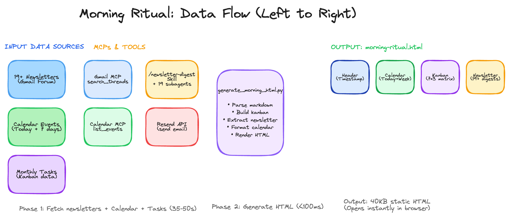
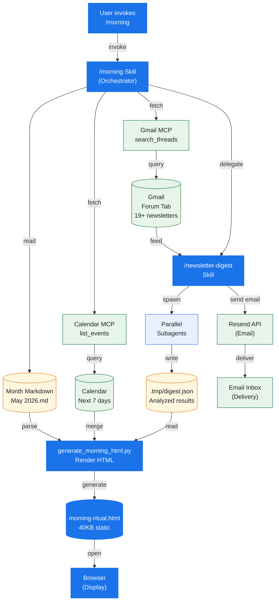

# Morning Ritual — Automated Daily Briefing System

A fully-automated daily intelligence engine that consolidates newsletters, calendar events, and monthly strategic planning into a single HTML artifact. Runs at 7:00 AM daily in ~60–80 seconds.

## The Problem

Every morning, you context-switch across:
- Email inbox (19+ newsletters)
- Calendar application (meetings, deadlines)
- Task tracking (monthly domain goals)

**Cost**: 5–10 minutes of daily synthesis + 20–30% cognitive tax per app switch = ~40 hours/year lost to context overhead.

## The Solution

**One briefing file. One click. Complete situational awareness.**

The `/morning` ritual orchestrates:
1. **Newsletter Intelligence** — 19+ newsletters analyzed in parallel, delivered to inbox
2. **Calendar Context** — Today's meetings + next 7 days
3. **Strategic Kanban** — 7 life domains × 3-week rolling horizon
4. **One-Click Access** — 40KB static HTML file, opens in <1 second, all data pre-loaded

**Result: 60–80 seconds. Zero manual intervention. ~40 hours/year reclaimed.**

## How It Works

```
Email Newsletters         Calendar Events         Monthly Markdown
     (19)        ───→       (7 days)       ───→    (domain tasks)
        │                      │                       │
        └──────────────────────┼───────────────────────┘
                               ↓
                    Python Script (100ms)
                               ↓
                    morning-ritual.html
                               ↓
                          Browser (instant)
```



**Data Pipeline:**
- Gmail MCP fetches newsletters from Forum tab (category:forums, newer_than:1d)
- Google Calendar MCP fetches today + next 7 days
- Month markdown auto-detected from system date (e.g., `May 2026.md`)
- Python script parses markdown → builds kanban matrix (7 domains × 3 weeks)
- Extracts newsletter HTML → embeds in output
- Generates complete HTML with fresh timestamp
- All data baked in → opens instantly with zero additional API calls

## System Architecture



**Data Flow**:
- **Entry**: User invokes `/morning` skill
- **Fetch**: Parallel fetch from Gmail (forums), Calendar (next 7 days), and Month Markdown
- **Analyze**: `/newsletter-digest` skill spawns subagents to analyze each email in parallel
- **Merge**: Python script combines newsletter digest JSON, calendar events, and kanban markdown into single HTML
- **Output**: Static 40KB HTML file with dark gradient header, session recap, calendar, kanban board, and newsletter table
- **Display**: File opened in default browser for instant viewing (zero additional API calls)
- **Archive**: Dated copy saved to `calendar-projects/morning/morning-YYYY-MM-DD.html` for history
- **Email**: Newsletter digest also sent to inbox via Resend API

**Color Legend**: 🔵 Blue = Orchestrator | 🔷 Light Blue = Subagents (parallel workers) | 🟡 Yellow = Storage (data sources, files) | 🟢 Green = External services (MCP, API, delivery)

See [DATA_ARCHITECTURE.md](DATA_ARCHITECTURE.md) for detailed component breakdown and data platform documentation.

## Quick Start

### Prerequisites
- Claude Code (local, web, or IDE extension)
- Gmail with newsletters in Forum tab
- Google Calendar
- Resend API account (free tier: 3k emails/month)

### Setup (5 minutes)

1. **Clone this repo**:
   ```bash
   git clone https://github.com/xj-2045/morning-ritual.git
   cd morning-ritual
   ```

2. **Create `.env` file**:
   ```bash
   RESEND_API_KEY=re_xxxx...
   RESEND_FROM=onboarding@resend.dev
   RESEND_TO=your-email@example.com
   ```

3. **Create month markdown** in `calendar-projects/[Month] [Year].md`:
   ```markdown
   ## Week of May 11-17
   **Focus**: Strategic priorities
   
   ### Domain 1
   - [ ] Task A
   - [ ] Task B
   
   ### Domain 2
   - [ ] Task C
   ...
   ```

4. **Run `/morning` in Claude Code**:
   ```
   /morning
   ```

**Done.** Fresh briefing opens in browser within 60–80 seconds.

## Features

✅ **Fully automated** — 7 AM daily or on-demand  
✅ **60–80 second total latency** — newsletter analysis is the critical path  
✅ **Zero credentials exposed** — uses MCP OAuth + environment variables  
✅ **Static HTML output** — 40KB file loads instantly, zero additional API calls  
✅ **Session Recap** — Top 5 topics with proportional token bars (fixated format for consistency)
✅ **Kanban board** — 7 domains × 3 weeks, color-coded, auto-generated from month markdown  
✅ **Newsletter digest** — 19+ analyzed newsletters with full HTML formatting embedded  
✅ **Calendar context** — today + next 7 days visible at a glance  
✅ **Coffee Card** — Morning ritual theme (☕ floating animation, "20 minutes with WSJ")
✅ **Production-ready** — runs daily without manual intervention  
✅ **Dynamic markdown parsing** — Auto-detects month file and extracts all domains with tasks  

## Architecture

- **Layer 1**: `/morning` skill orchestrates workflow
- **Layer 2**: Skills & MCP servers (newsletter-digest, Google Calendar, Gmail)
- **Layer 3**: Python script handles HTML generation

**See [ARCHITECTURE.md](ARCHITECTURE.md)** for complete technical reference.

## Performance

| Phase | Duration | Note |
|-------|----------|------|
| Newsletter digest | 30–50s | Critical path (Gmail API + subagent analysis) |
| Calendar + markdown | 3–5s | Network + file read |
| HTML generation | <100ms | Python regex parsing |
| Browser open | ~10s | OS startup time |
| **Total** | **60–80s** | End-to-end |

## Key Documents

- **[SETUP.md](SETUP.md)** — Step-by-step configuration guide
- **[ARCHITECTURE.md](ARCHITECTURE.md)** — Technical deep dive (kanban algorithm, subagent batching, performance breakdown)
- **[DATA_ARCHITECTURE.md](DATA_ARCHITECTURE.md)** — Data sources, platforms, and processing pipeline with Mermaid diagram
- **[EXECUTIVE_SUMMARY.md](EXECUTIVE_SUMMARY.md)** — Business value and ROI

## Files

```
.
├── README.md                          # This file
├── SETUP.md                           # Configuration guide
├── ARCHITECTURE.md                    # Technical reference
├── EXECUTIVE_SUMMARY.md               # Business value
├── .gitignore                         # Exclude .env, credentials
└── .claude/skills/morning/
    ├── SKILL.md                       # Skill definition
    └── scripts/
        └── generate_morning_html.py   # HTML generation (Python)
```

## Daily Workflow

**Every morning at 7:00 AM** (or anytime):

1. Type `/morning` in Claude Code
2. Wait ~60–80 seconds
3. Fresh briefing opens in browser
4. Review schedule + priorities + newsletters
5. Go build

**That's it.** No manual email checking or context switching.

## Customization

### Change sender email
Edit `.env`:
```bash
RESEND_FROM=your-domain@yourdomain.com  # Must be verified in Resend
```

### Change recipient
Edit `.env`:
```bash
RESEND_TO=your-new-email@example.com
```

### Add custom domains
Edit `.claude/skills/morning/scripts/generate_morning_html.py`:
- Find `DOMAIN_COLORS` dict (~line 12)
- Add: `"Domain 8": {"header": "#fff8f0", "cell": "#fef5f1"}`
- Update month markdown to use `### Domain 8`

### Change month markdown location
Edit `.claude/skills/morning/SKILL.md`:
- Look for `calendar-projects/$(date '+%b %Y').md`
- Replace with custom path

## Extending This System

Same architecture extends to:
- **Weekly review** — summarize week, plan next week
- **Monthly forecasting** — review domain goals, adjust quarterly targets
- **Quarterly planning** — assess progress toward annual vision

## Troubleshooting

**Newsletter digest fails:**
- Check RESEND_API_KEY is valid (https://resend.com/api-keys)
- Verify RESEND_FROM is verified in Resend dashboard
- Check monthly email limit (3k/month free tier)

**Calendar events missing:**
- Confirm events exist in Google Calendar
- Verify Google Calendar MCP is connected

**Kanban board blank:**
- Check month markdown format (see [SETUP.md](SETUP.md))
- Verify domain names match exactly
- Confirm `## Week of` sections exist in markdown

**HTML doesn't open:**
- Try opening the HTML file manually
- Check file permissions

See [SETUP.md](SETUP.md) for complete troubleshooting guide.

## License

MIT — Use freely, modify, extend.

## Next Steps

1. Follow [SETUP.md](SETUP.md) to configure
2. Run `/morning` your first time
3. Iterate on month markdown format
4. Extend to weekly/monthly rituals using same pattern

---

**One 40KB file, one minute of setup, every morning — complete situational awareness before any other tool opens.**

Built with Claude Code, MCP, and Python. No external dependencies.
