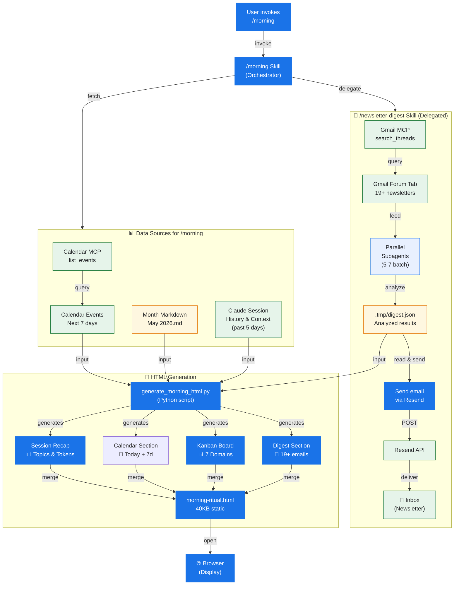

# Morning Ritual — Automated Daily Briefing System

A fully-automated daily intelligence engine that consolidates newsletters, calendar events, and monthly strategic planning into a single HTML artifact. Runs at 7:00 AM daily in ~60–80 seconds.

## The Problem

Every morning, you context-switch across:
- Email inbox (19+ newsletters)
- Calendar application (meetings, deadlines)
- Task tracking (monthly domain goals)

**Cost**: 5–10 minutes of daily synthesis + 20–30% cognitive tax per app switch = ~40 hours/year lost to context overhead.

## The Solution

**One briefing file. One click. Complete situational awareness.**

The `/morning` ritual orchestrates:
1. **Newsletter Intelligence** — 19+ newsletters analyzed in parallel, delivered to inbox
2. **Calendar Context** — Today's meetings + next 7 days
3. **Strategic Kanban** — 7 life domains × 3-week rolling horizon
4. **One-Click Access** — 40KB static HTML file, opens in <1 second, all data pre-loaded

**Result: 60–80 seconds. Zero manual intervention. ~40 hours/year reclaimed.**

## System Architecture



### Data Flow Architecture

**Orchestration Layer:**
- **User** invokes `/morning` skill
- **/morning skill** is the main orchestrator that:
  1. **Delegates** to `/newsletter-digest` skill (background box) for email processing
  2. **Fetches** from data sources (Calendar, Markdown, Session History)
  3. Runs Python script to merge all data
  4. Opens final HTML in browser

**📧 /newsletter-digest Skill (Delegated Background Box):**
This is a **separate skill** (shown as background grouping) that handles all newsletter processing:
1. **Fetch**: Gmail MCP queries Forum tab for 19+ newsletters
2. **Analyze**: Spawns 5-7 subagents in parallel to analyze each email
3. **Store**: Results written to `.tmp/digest.json`
4. **Send**: Reads analysis results and sends HTML digest email via Resend
5. **Outputs**: Both `.tmp/digest.json` (for /morning) and email delivery

**📊 Data Sources for /morning HTML Generation:**
1. **Newsletter Analysis** — `.tmp/digest.json` from `/newsletter-digest`
2. **Calendar Events** — Calendar MCP queries next 7 days
3. **Kanban Data** — Month Markdown file (parsed for 7 domains × 3 weeks)
4. **Session History** — Claude Code session context (past 5 days of built projects, discussions, token estimates)

**🔧 HTML Generation Pipeline:**
Python script reads all four data sources and generates five HTML sections:
- **Session Recap** ← built from Claude session history (topics, token usage, built/chatted summary)
- **Calendar Section** ← built from Calendar MCP data
- **Kanban Board** ← built from Month Markdown (regex parsing)
- **Newsletter Digest** ← built from `.tmp/digest.json` (full HTML formatting)
- **Coffee Card** ← hardcoded with floating animation

All five sections merge into single 40KB `morning-ritual.html` that opens in browser.

### Timing Breakdown

| Phase | Duration | Notes |
|-------|----------|-------|
| /newsletter-digest execution | 30–45s | Critical path (subagent analysis bottleneck) |
| Calendar + Markdown + Session History fetch | 3–5s | Parallel with newsletter analysis |
| HTML generation | <100ms | Python string templating |
| Browser open | ~10s | OS startup time |
| **Total** | **60–80s** | End-to-end |

### Key Architecture Decisions

**🎨 Color Legend:**
- 🔵 **Blue** — Orchestrator (main skill entry points)
- 🔷 **Light Blue** — Subagents (parallel workers)
- 🟡 **Yellow** — Storage (data sources, files, temp JSON)
- 🟢 **Green** — External services (MCP, API, delivery)

**1. /newsletter-digest is Delegated** (shown as background box):
- `/morning` skill does NOT reimplement newsletter logic
- Delegates entirely to `/newsletter-digest` skill
- Allows `/newsletter-digest` to run standalone (just email) or as part of `/morning` (full briefing)

**2. Session History is an Explicit Data Source** (now visible):
- Claude Code session context feeds into Python script
- Topics extracted from past 5 days of interactions
- Token estimates computed from language model usage
- Not fetched from any API; built from session data

**3. Email Delivery is Part of /newsletter-digest**:
- Subagents write analysis to `.tmp/digest.json`
- `/newsletter-digest` reads that file and sends email
- Ensures email content is current with analysis results

**4. All Data is Pre-baked into HTML**:
- No dynamic loading or API calls after generation
- Browser opens and renders instantly
- Timestamp in header proves data freshness

## Quick Start

### Prerequisites
- Claude Code (local, web, or IDE extension)
- Gmail with newsletters in Forum tab
- Google Calendar
- Resend API account (free tier: 3k emails/month)

### Setup (5 minutes)

1. **Clone this repo**:
   ```bash
   git clone https://github.com/xj-2045/morning-ritual.git
   cd morning-ritual
   ```

2. **Create `.env` file**:
   ```bash
   RESEND_API_KEY=re_xxxx...
   RESEND_FROM=onboarding@resend.dev
   RESEND_TO=your-email@example.com
   ```

3. **Create month markdown** in `calendar-projects/[Month] [Year].md`:
   ```markdown
   ## Week of May 11-17
   **Focus**: Strategic priorities
   
   ### Domain 1
   - [ ] Task A
   - [ ] Task B
   
   ### Domain 2
   - [ ] Task C
   ...
   ```

4. **Run `/morning` in Claude Code**:
   ```
   /morning
   ```

**Done.** Fresh briefing opens in browser within 60–80 seconds.

## Features

✅ **Fully automated** — 7 AM daily or on-demand  
✅ **60–80 second total latency** — newsletter analysis is the critical path  
✅ **Zero credentials exposed** — uses MCP OAuth + environment variables  
✅ **Static HTML output** — 40KB file loads instantly, zero additional API calls  
✅ **Session Recap** — Top 5 topics with proportional token bars (fixated format for consistency)
✅ **Kanban board** — 7 domains × 3 weeks, color-coded, auto-generated from month markdown  
✅ **Newsletter digest** — 19+ analyzed newsletters with full HTML formatting embedded  
✅ **Calendar context** — today + next 7 days visible at a glance  
✅ **Coffee Card** — Morning ritual theme (☕ floating animation, "20 minutes with WSJ")
✅ **Production-ready** — runs daily without manual intervention  
✅ **Dynamic markdown parsing** — Auto-detects month file and extracts all domains with tasks  

## Architecture

- **Layer 1**: `/morning` skill orchestrates workflow
- **Layer 2**: Skills & MCP servers (newsletter-digest, Google Calendar, Gmail)
- **Layer 3**: Python script handles HTML generation

## Performance

| Phase | Duration | Note |
|-------|----------|------|
| Newsletter digest | 30–50s | Critical path (Gmail API + subagent analysis) |
| Calendar + markdown | 3–5s | Network + file read |
| HTML generation | <100ms | Python regex parsing |
| Browser open | ~10s | OS startup time |
| **Total** | **60–80s** | End-to-end |

## Key Documents

- **[SETUP.md](SETUP.md)** — Step-by-step configuration guide

## Files

```
.
├── README.md                          # This file
├── SETUP.md                           # Configuration guide
├── .gitignore                         # Exclude .env, credentials
└── .claude/skills/morning/
    ├── SKILL.md                       # Skill definition
    └── scripts/
        └── generate_morning_html.py   # HTML generation (Python)
```

## Daily Workflow

**Every morning at 7:00 AM** (or anytime):

1. Type `/morning` in Claude Code
2. Wait ~60–80 seconds
3. Fresh briefing opens in browser
4. Review schedule + priorities + newsletters
5. Go build

**That's it.** No manual email checking or context switching.

## Customization

### Change sender email
Edit `.env`:
```bash
RESEND_FROM=your-domain@yourdomain.com  # Must be verified in Resend
```

### Change recipient
Edit `.env`:
```bash
RESEND_TO=your-new-email@example.com
```

### Add custom domains
Edit `.claude/skills/morning/scripts/generate_morning_html.py`:
- Find `DOMAIN_COLORS` dict (~line 12)
- Add: `"Domain 8": {"header": "#fff8f0", "cell": "#fef5f1"}`
- Update month markdown to use `### Domain 8`

### Change month markdown location
Edit `.claude/skills/morning/SKILL.md`:
- Look for `calendar-projects/$(date '+%b %Y').md`
- Replace with custom path

## Extending This System

Same architecture extends to:
- **Weekly review** — summarize week, plan next week
- **Monthly forecasting** — review domain goals, adjust quarterly targets
- **Quarterly planning** — assess progress toward annual vision

## Troubleshooting

**Newsletter digest fails:**
- Check RESEND_API_KEY is valid (https://resend.com/api-keys)
- Verify RESEND_FROM is verified in Resend dashboard
- Check monthly email limit (3k/month free tier)

**Calendar events missing:**
- Confirm events exist in Google Calendar
- Verify Google Calendar MCP is connected

**Kanban board blank:**
- Check month markdown format (see [SETUP.md](SETUP.md))
- Verify domain names match exactly
- Confirm `## Week of` sections exist in markdown

**HTML doesn't open:**
- Try opening the HTML file manually
- Check file permissions

See [SETUP.md](SETUP.md) for complete troubleshooting guide.

## License

MIT — Use freely, modify, extend.

## Next Steps

1. Follow [SETUP.md](SETUP.md) to configure
2. Run `/morning` your first time
3. Iterate on month markdown format
4. Extend to weekly/monthly rituals using same pattern

---

**One 40KB file, one minute of setup, every morning — complete situational awareness before any other tool opens.**

Built with Claude Code, MCP, and Python. No external dependencies.
